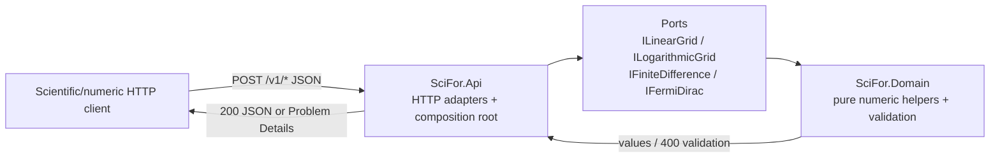

# Preface
This represents the second iteration of the Modernization extension of the Artifact-Driven Development methodology.  

I consider it successful in that it did convert a slice of functionality of the original Fortran library into REST endpoints written in C# using .Net 8.

The Modernization extension of Artifact-Driven Development is incomplete at this point.  This was mainly a walking skeleton to make sure it could work.  The next iteration should be much closer and follow the tenets more closely.

# SciFor Fortran Port

This repository is a port of SciFor/SciFortran from Fortran 90/95 (static library `libscifor.a`) to C# / .NET 8 / ASP.NET Core HTTP/JSON services. Assessment verdict is `go-with-conditions` on a bounded `T1 executable` oracle. Staging is phased-rewrite; first product slice is XP-060, XP-061, XP-072, XP-108. See [`docs/modernization/migration-plan.md`](docs/modernization/migration-plan.md). Product thesis: four rewritten numeric helpers as HTTP/JSON with per-path T1 parity — not a Fortran ABI or production SciFor redistribution ([`docs/PURPOSE.md`](docs/PURPOSE.md)).

## Table of Contents

- [Preface](#preface)
- [SciFor Fortran Port](#scifor-fortran-port)
  - [Table of Contents](#table-of-contents)
  - [Modernization](#modernization)
    - [What this is](#what-this-is)
    - [Lane status](#lane-status)
    - [Artifact index](#artifact-index)
  - [Requirements](#requirements)
  - [High-Level Architecture](#high-level-architecture)
  - [Technical Stack](#technical-stack)
  - [Key Design Decisions](#key-design-decisions)
    - [1. Rewrite behind HTTP, do not wrap Fortran](#1-rewrite-behind-http-do-not-wrap-fortran)
    - [2. Boring REST contract with 400 Problem Details](#2-boring-rest-contract-with-400-problem-details)
    - [3. Optional grid args default like Fortran](#3-optional-grid-args-default-like-fortran)
    - [4. Per-path numeric parity, not global tolerance](#4-per-path-numeric-parity-not-global-tolerance)
    - [5. No persistence or auth](#5-no-persistence-or-auth)
    - [Project Structure](#project-structure)
    - [Logging and Observability](#logging-and-observability)
  - [Prerequisites](#prerequisites)
  - [Getting Started](#getting-started)
    - [Configure environment](#configure-environment)
    - [Run the API](#run-the-api)
  - [Available Scripts](#available-scripts)
  - [API Contract](#api-contract)
  - [Environment Variables](#environment-variables)
  - [Backlog Items](#backlog-items)
    - [Epic 1: S1 numeric helpers HTTP/JSON](#epic-1-s1-numeric-helpers-httpjson)
  - [License](#license)

## Modernization

### What this is

This repo ports SciFor/SciFortran, a Fortran 90/95 numeric library (`libscifor.a`, no application framework), to C# / .NET 8 ASP.NET Core HTTP/JSON services. Legacy behavior is evidence for recovery and parity, not an automatic product requirement. S1 shipped: `linspace`, `logspace`, `deriv`, and `fermi` (XP-060, XP-061, XP-072, XP-108) as HTTP/JSON with per-path T1 parity (SF-1 Done, M5 accepted). Staging, slice order, and S2+ prerequisites live in the migration plan.

- Legacy repo: `/Users/philipteitel/code/ADD-migrations/sci-fortran-legacy` (`e586903a26cc50ca8942f20ca3bccbd8814e6252`)
- Source stack: Fortran 90/95 free-form modules / static library `libscifor.a` (no application framework)
- Target stack: C# / .NET 8 / ASP.NET Core (HTTP/JSON services)
- Assessment: [`docs/modernization/ASSESSMENT.md`](docs/modernization/ASSESSMENT.md)

### Lane status

| Field | Value |
|-------|-------|
| Phase | Planning |
| Verdict | go-with-conditions |
| Oracle tier | T1 executable (bounded) |
| Gate | **M5 accepted** (SF-1) |
| First / current slice | S1 Complete / SF-1 Done (XP-060, XP-061, XP-072, XP-108) |
| Next command | `/document-legacy` scoped to next S2 XP IDs (migration plan: further DEP-001-only APIs; e.g. XP-062 `arange`) — or pick S2 XP set |

Phase stays `Assessment` or `Planning` here. Recovery and delivery progress show up in the Artifact index (path details, test plans) and in **Backlog Items**. Do not add a third progress narrative.

### Artifact index

| Artifact | Owner | Status | Link |
|----------|-------|--------|------|
| Execution path inventory | Archaeologist | v1 Snapshot | [`docs/modernization/execution-path-inventory.md`](docs/modernization/execution-path-inventory.md) |
| Dependency inventory | Migration Strategist | v2 Snapshot | [`docs/modernization/dependency-inventory.md`](docs/modernization/dependency-inventory.md) |
| Dependency graph | Archaeologist | v2 Snapshot | [`docs/modernization/dependency-graph.md`](docs/modernization/dependency-graph.md) |
| Impedance analysis | Migration Strategist | v1 Snapshot | [`docs/modernization/impedance-analysis.md`](docs/modernization/impedance-analysis.md) |
| Oracle | Implementer | v1 Snapshot | [`docs/modernization/oracle.md`](docs/modernization/oracle.md) |
| Assessment | Migration Strategist | present | [`docs/modernization/ASSESSMENT.md`](docs/modernization/ASSESSMENT.md) |
| Decision register | Migration Strategist | present (DEC-001–DEC-007) | [`docs/modernization/decision-register.md`](docs/modernization/decision-register.md) |
| Path details | Archaeologist | 4 files | [`docs/modernization/paths/`](docs/modernization/paths/) |
| Purpose | Modeler | Draft (S1 recovery) | [`docs/PURPOSE.md`](docs/PURPOSE.md) |
| Domain model | Modeler | Draft (S1 recovery) | [`docs/DOMAIN.md`](docs/DOMAIN.md) |
| Defect ledger | Archaeologist | present (DEF-001–DEF-006) | [`docs/modernization/defect-ledger.md`](docs/modernization/defect-ledger.md) |
| Migration plan | Migration Strategist | present (phased-rewrite; S1 XP-060, XP-061, XP-072, XP-108) | [`docs/modernization/migration-plan.md`](docs/modernization/migration-plan.md) |
| Path test plans | Architect | 4 files | [`docs/modernization/test-plans/`](docs/modernization/test-plans/) |
| Port stories | Architect | 1 file (SF-1) | [`docs/features/`](docs/features/) |
| Parity reports | QA | 1 file | [`docs/modernization/parity/`](docs/modernization/parity/) |

## Requirements

**Purpose and domain model**

- Purpose: [`docs/PURPOSE.md`](docs/PURPOSE.md) — S1 POC thesis: rewrite linear grid, logarithmic grid, finite-difference derivative, and Fermi–Dirac occupation as HTTP/JSON with per-path T1 parity (Draft)
- Domain model: [`docs/DOMAIN.md`](docs/DOMAIN.md) — ubiquitous language and data dictionary for those four helpers (Draft)

**Requirement files**

- [`docs/requirements/REQ-001-s1-numeric-helpers.md`](docs/requirements/REQ-001-s1-numeric-helpers.md) — S1 four HTTP/JSON numeric helpers (Gherkin S1–S26)

**Architecture decisions included for traceability for backlog alignment**

- [`docs/decisions/ADR-001-target-stack-aspnet-http-json.md`](docs/decisions/ADR-001-target-stack-aspnet-http-json.md) — Accepted; C# / .NET 8 / ASP.NET Core HTTP/JSON (DEC-001)
- [`docs/decisions/ADR-002-s1-http-json-contract.md`](docs/decisions/ADR-002-s1-http-json-contract.md) — Accepted; routes, JSON shapes, HTTP 400 for invalid inputs
- [`docs/decisions/ADR-003-hexagonal-numeric-vs-http.md`](docs/decisions/ADR-003-hexagonal-numeric-vs-http.md) — Accepted; domain library vs HTTP adapters; no `libscifor.a` P/Invoke
- [`docs/decisions/ADR-004-optional-grid-arg-json-fields.md`](docs/decisions/ADR-004-optional-grid-arg-json-fields.md) — Accepted; optional `istart`/`iend`/`mesh`/`base` with Fortran defaults

## High-Level Architecture

S1 is a small hexagonal ASP.NET Core service: HTTP adapters accept JSON, map to domain operations defined in [`docs/DOMAIN.md`](docs/DOMAIN.md), and return parsed-number results suitable for per-path T1 parity (DEC-005). There is no database, auth layer, or Fortran interop. Oracle harnesses (XP-386–XP-388) stay outside the product host.

Consistency boundaries from the domain model map 1:1 to request-scoped computations: linear grid, logarithmic grid (composing an internal both-endpoints linear grid in log space), finite-difference derivative over a sampled series, and Fermi–Dirac occupation evaluation.



## Technical Stack

| Layer | Technology | Rationale |
|-------|------------|-----------|
| Language / runtime | C# / .NET 8 | DEC-001; profile `stack.language` |
| HTTP host | ASP.NET Core (Minimal APIs or controllers) | DEC-001; ADR-001 |
| JSON | System.Text.Json, camelCase | ADR-002 wire contract |
| Domain | Class library (`SciFor.Domain`) | ADR-003; no ASP.NET references |
| Logging | `Microsoft.Extensions.Logging` (structured JSON in non-dev as needed) | Profile logger defaults |
| Tests | `dotnet test` (xUnit) — Domain, Api, and Parity projects | Profile `stack.testCommand`; Phase P in `SciFor.Parity.Tests` |
| Numeric | BCL `double` | DEP-001-only rewrite; no NR/MKL (DEC-007) |

## Key Design Decisions

### 1. Rewrite behind HTTP, do not wrap Fortran

S1 rewrites the four helpers in C# (DEC-003). Controllers must not P/Invoke `libscifor.a` (ADR-003, IMP-001).

### 2. Boring REST contract with 400 Problem Details

Four `POST /v1/...` endpoints per ADR-002. Invalid inputs and DEF fix-now cases return **400** structured Problem Details, not 500 or process abort (IMP-004).

### 3. Optional grid args default like Fortran

Omitted `istart`/`iend` → both true; omitted `base` → 10; request `mesh: true` asks for numeric spacing in the response (ADR-004).

### 4. Per-path numeric parity, not global tolerance

Comparison rules live in path test plans (rel/abs `1e-12` for S1). Design does not invent a system-wide gate (DEC-005).

### 5. No persistence or auth

S1 is a stateless numeric POC. No database, identity, or secrets store.

### Project Structure

```
sci-fortran-port-2/
├── SciFor.sln
├── src/
│   ├── SciFor.Domain/          # pure helpers, validation, port interfaces
│   └── SciFor.Api/             # ASP.NET Core host, DTOs, HTTP adapters, Program.cs
├── tests/
│   ├── SciFor.Domain.Tests/    # unit + port contract tests
│   ├── SciFor.Api.Tests/       # HTTP integration tests (WebApplicationFactory)
│   └── SciFor.Parity.Tests/    # Phase P numeric parity vs T1 / XP-388 pin
├── docs/
│   ├── PURPOSE.md
│   ├── DOMAIN.md
│   ├── requirements/
│   ├── decisions/
│   ├── features/               # port stories (later)
│   └── modernization/
└── README.md
```

### Logging and Observability

- **Logger** — `Microsoft.Extensions.Logging` via ASP.NET Core defaults.
- **Format** — structured console/JSON suitable for POC; pretty console acceptable in Development only.
- **Request/correlation IDs** — use ASP.NET Core request logging / `TraceIdentifier` on error Problem Details where useful.
- **Log levels** — `debug`, `info`, `warn`, `error` per profile.
- **Sensitive data** — no credentials in S1; do not log full large `f` arrays at info (debug only if needed).

## Prerequisites

- [.NET 8 SDK](https://dotnet.microsoft.com/download/dotnet/8.0)
- For parity later: access to the bounded T1 oracle environment described in [`docs/modernization/oracle.md`](docs/modernization/oracle.md) (not required to compile the C# solution)

## Getting Started

```bash
# From the repo root (after solution projects exist)
dotnet restore
dotnet build
dotnet test
```

### Configure environment

```bash
# Optional; defaults work for local POC
export ASPNETCORE_ENVIRONMENT=Development
export ASPNETCORE_URLS=http://localhost:5228
```

### Run the API

```bash
dotnet run --project src/SciFor.Api
```

Default launch profile listens on `http://localhost:5228` (`Properties/launchSettings.json`). Override with `ASPNETCORE_URLS` if needed.

Example:

```bash
curl -s http://localhost:5228/v1/linspace \
  -H 'Content-Type: application/json' \
  -d '{"start":0,"stop":1,"num":5}'
```

## Available Scripts

| Command | Description |
|---------|-------------|
| `dotnet restore` | Restore packages |
| `dotnet build` | Build / type-check |
| `dotnet format --verify-no-changes` | Lint / format verify |
| `dotnet test` | Run unit, integration, and Phase P parity tests |
| `dotnet run --project src/SciFor.Api` | Run API locally |

## API Contract

Binding detail: [`ADR-002`](docs/decisions/ADR-002-s1-http-json-contract.md), optional fields: [`ADR-004`](docs/decisions/ADR-004-optional-grid-arg-json-fields.md).

| Path | Method | Purpose |
|------|--------|---------|
| `/v1/linspace` | POST | Linear grid → `{ "values": number[], "mesh"?: number }` |
| `/v1/logspace` | POST | Logarithmic grid → `{ "values": number[] }` |
| `/v1/deriv` | POST | Finite-difference derivative → `{ "df": number[] }` |
| `/v1/fermi` | POST | Fermi–Dirac occupation (scalar) → `{ "value": number }` |

Invalid inputs → **400** `application/problem+json` (DEF-001, DEF-003–DEF-006, `num<0`, both-endpoints `num<2`, malformed bodies).

## Environment Variables

| Variable | Default | Description |
|----------|---------|-------------|
| `ASPNETCORE_ENVIRONMENT` | `Production` (host default) | Use `Development` locally |
| `ASPNETCORE_URLS` | host default (`http://localhost:5228` via launch profile) | Listen URLs |

No application-specific secrets or connection strings for S1.

## Backlog Items

### Epic 1: S1 numeric helpers HTTP/JSON

First product slice: rewrite XP-060, XP-061, XP-072, and XP-108 as ASP.NET Core HTTP/JSON services with per-path T1 numeric parity (REQ-001). This story is also the walking skeleton for the composition root and four routes.

| ID | Status | Story | Size | Notes |
|----|--------|-------|------|-------|
| [`SF-1`](docs/features/SF-1-s1-numeric-helpers.md) | Done | Port linspace, logspace, deriv, and fermi as HTTP/JSON with per-path T1 parity | Medium | XP-060, XP-061, XP-072, XP-108; ADR-001–004; REQ-001 S1–S26 |

## License

See [`LICENSE.md`](LICENSE.md). This tree is **never** to be used except to evaluate the Artifact-Driven Development methodology. It is not MIT-licensed and is not a production SciFor port.
