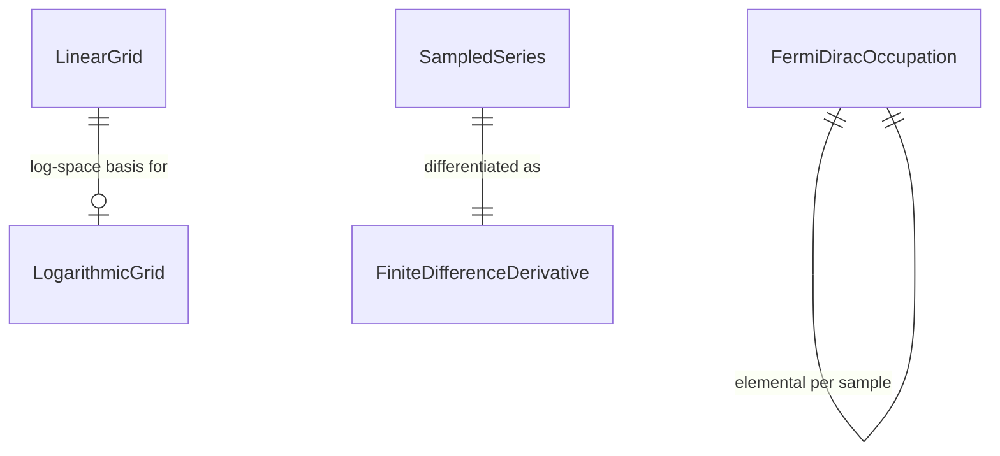

<!--
Domain model artifact contract:
- Produced by /recover-domain (modeler in Legacy recovery mode) for first-slice recovery (XP-060, XP-061, XP-072, XP-108).
- DOMAIN.md is canonical for ubiquitous language, data meaning, entities, relationships, invariants, lifecycles, and consistency boundaries.
- Every term, field, invariant, lifecycle, and relationship must trace to source material or a resolved question.
- Status is Draft until Human approval at greenfield purpose/domain gates.
- Do not invent architecture, APIs, stack tables, or stories here.
-->

# Domain Model: SciFor Numeric Helpers Port (S1 POC)

**Source material:**
- `docs/PURPOSE.md` (this recovery pass)
- `docs/modernization/paths/XP-060-linspace.md`
- `docs/modernization/paths/XP-061-logspace.md`
- `docs/modernization/paths/XP-072-deriv.md`
- `docs/modernization/paths/XP-108-fermi.md`
- `docs/modernization/ASSESSMENT.md`
- `docs/modernization/decision-register.md` (DEC-001–DEC-007)
- `docs/modernization/migration-plan.md` (S1)
- `README.md` (§ What this is)
- `LICENSE.md`

**Date:** 2026-08-25  
**Status:** Draft

---

## 1. Purpose alignment

This model names the four first-slice numeric concepts the purpose document commits to serve as HTTP/JSON with per-path T1 parity: linear grid, logarithmic grid, finite-difference derivative, and Fermi–Dirac occupation. It does not model the full SciFor library. See [`docs/PURPOSE.md`](PURPOSE.md).

## 2. Ubiquitous language

| Term | Definition | Accepted aliases | Do not use | Source |
|------|------------|------------------|------------|--------|
| Linear grid | A length-`num` sequence of evenly spaced real values between `start` and `stop`, with optional inclusion/exclusion of each endpoint and optional reported spacing. | — | Prefer not to treat Fortran symbol `linspace` or module `TOOLS` as the domain name in requirements/stories (candidate legacy names only). | E3 XP-060 `src/tools_grids.f90:1-29`; E1 probe sample oracle.md §1 via XP-060 |
| Logarithmic grid | A length-`num` sequence of values uniformly spaced in log-`base` coordinates between `start` and `stop` (default `base` 10), obtained by log-mapping endpoints, building a both-endpoints linear grid in that space, then exponentiating. | — | Prefer not to treat Fortran symbol `logspace` as the domain name in requirements/stories. | E3 XP-061 `src/tools_grids.f90:32-47`; E1 probe via XP-061 |
| Endpoint inclusion | Whether the linear grid includes the start point, the stop point, both, or neither; defaults to both. | start-endpoint flag, end-endpoint flag | Do not invent separate “open/closed interval” product jargon beyond the four flag combinations in source. | E3 XP-060 `src/tools_grids.f90:8-26` |
| Grid spacing | The constant step used to build a linear grid; may be returned as optional `mesh`. | step, mesh (legacy arg name) | Do not treat `mesh` as a mesh topology entity. | E3 XP-060 `src/tools_grids.f90:13-28` |
| Finite-difference derivative | A same-length real sequence approximating the derivative of a sampled series `f` under uniform abscissa spacing `dh`: forward difference at the first sample, centered differences in the interior, backward difference at the last sample. | — | Prefer not to treat Fortran symbol `deriv` as the domain name in requirements/stories. Do not imply a general nonuniform-`x` derivative API (API has only `dh`). | E3 XP-072 `src/TOOLS.f90:175-186`; E1 probe via XP-072 |
| Sampled series | Rank-1 real samples `f` whose finite-difference derivative is requested. | sample values | Do not call this a “time series” unless a later source says so. | E3 XP-072 `src/TOOLS.f90:176-178` |
| Uniform abscissa spacing | Scalar `dh` assumed constant between consecutive samples of the series. | dh, spacing | Do not model a full abscissa array as part of this operation’s contract. | E3 XP-072 `src/TOOLS.f90:177`; E3 XP-072 driver uses `x(2)-x(1)` |
| Fermi–Dirac occupation | Scalar (or elemental array) value `1/(1+exp(beta*x))`, except exactly `0` when `x*beta > 100` (strict `>`, without evaluating `exp`). | fermi (legacy symbol, accepted only as alias) | Prefer not to treat module `FUNCTIONS` as a domain entity. Do not treat Zhang/Jin specials as part of this concept (same compile unit, not on path). | E3 XP-108 `src/FUNCTIONS.f90:240-247`; E1 probe via XP-108 |
| Overflow cutoff | The guard `x*beta > 100` that forces occupation to `0` without `exp`. | saturation guard | Do not rename to a different numeric threshold without evidence. | E3 XP-108 `src/FUNCTIONS.f90:243-246`; E1 `x=2`, `beta=100` → `0` |
| First-slice numeric helper | One of the four S1 operations above; product surface is HTTP/JSON rewrite, not Fortran ABI. | S1 helper | Not “SciFor library drop-in”, not oracle harness XP-386–XP-388. | E2 DEC-002, DEC-003, DEC-006; README What this is |
| Bounded T1 oracle | The pinned executable oracle used for numeric comparison of these helpers (not a domain entity of the helpers themselves; listed so agents do not confuse corpus with product). | T1 executable | Not a product service; XP-388 is tooling. | E2 DEC-004; ASSESSMENT.md |

## 3. Data dictionary

| Field | Owner entity | Type / format | Required? | Constraints / allowed values | Source of value | Source |
|-------|--------------|---------------|-----------|------------------------------|-----------------|--------|
| `LinearGrid.start` | `LinearGrid` | real scalar (`real(8)` in legacy); same units as the grid | Yes | No extra domain check; `stop<start` yields decreasing grid; `start==stop` with both endpoints and `num>=2` yields constant values | caller | E3 XP-060 `src/tools_grids.f90:1-14` |
| `LinearGrid.stop` | `LinearGrid` | real scalar (`real(8)`) | Yes | Same as start | caller | E3 XP-060 `src/tools_grids.f90:1-14` |
| `LinearGrid.num` | `LinearGrid` | integer length | Yes | Abort if `num<0`; abort if `num<2` when both endpoints included; `num=0` with an endpoint excluded is unguarded in legacy (pending defect ledger) | caller | E3 XP-060 `src/tools_grids.f90:7,11-26` |
| `LinearGrid.includeStart` | `LinearGrid` | logical; legacy `istart` | No (default true) | With `includeStop`, selects one of four spacing formulas | caller / default | E3 XP-060 `src/tools_grids.f90:4-9` |
| `LinearGrid.includeStop` | `LinearGrid` | logical; legacy `iend` | No (default true) | Same | caller / default | E3 XP-060 `src/tools_grids.f90:4-9` |
| `LinearGrid.spacing` | `LinearGrid` | real scalar; legacy optional `mesh` | No | Equals the step used; assigned only if requested | derived | E3 XP-060 `src/tools_grids.f90:28` |
| `LinearGrid.values` | `LinearGrid` | real rank-1 length `num` | Yes (result) | Length equals `num` when computation completes | derived | E3 XP-060 `src/tools_grids.f90:1-14`; E1 `0,0.25,0.5,0.75,1` for `(0,1,5)` defaults |
| `LogarithmicGrid.start` | `LogarithmicGrid` | real scalar | Yes | Interpreted for `log`; exact `0` silently replaced by `1e-12` locally before log; negative non-zero is unguarded | caller (may be rewritten) | E3 XP-061 `src/tools_grids.f90:32-44` |
| `LogarithmicGrid.stop` | `LogarithmicGrid` | real scalar | Yes | Same zero rewrite as start | caller (may be rewritten) | E3 XP-061 `src/tools_grids.f90:42-44` |
| `LogarithmicGrid.num` | `LogarithmicGrid` | integer | Yes | Abort if `num<0`; both-endpoints linear grid underneath aborts if `num<2` | caller | E3 XP-061 `src/tools_grids.f90:41,45,12` |
| `LogarithmicGrid.base` | `LogarithmicGrid` | real scalar | No (default 10) | `base<=0` or `base==1` unguarded in legacy | caller / default | E3 XP-061 `src/tools_grids.f90:37-40,44` |
| `LogarithmicGrid.values` | `LogarithmicGrid` | real rank-1 length `num` | Yes (result) | Both endpoints included in log-space linear grid; first/last ≈ rewritten start/stop when `num>=2` | derived | E3 XP-061 `src/tools_grids.f90:45-46`; E1 `1…1000` log10 sample |
| `SampledSeries.values` | `SampledSeries` | real rank-1 length `L` | Yes | Legacy body does not guard `L<2` | caller | E3 XP-072 `src/TOOLS.f90:176-180` |
| `SampledSeries.abscissaSpacing` | `SampledSeries` | real scalar `dh` | Yes | Assumed uniform; `dh==0` unguarded | caller | E3 XP-072 `src/TOOLS.f90:177-185` |
| `FiniteDifferenceDerivative.values` | `FiniteDifferenceDerivative` | real rank-1 length `L`; units of `f/dh` | Yes (result) | `df(1)=(f(2)-f(1))/dh`; interior `(f(i+1)-f(i-1))/(2*dh)`; `df(L)=(f(L)-f(L-1))/dh` | derived | E3 XP-072 `src/TOOLS.f90:181-186` |
| `FermiDiracOccupation.x` | `FermiDiracOccupation` | real scalar (elemental over arrays) | Yes | Energy-like relative to `1/beta` (path wording); no domain unit enforced in source | caller | E3 XP-108 `src/FUNCTIONS.f90:241-242` |
| `FermiDiracOccupation.beta` | `FermiDiracOccupation` | real scalar | Yes | Inverse-temperature-like (path wording); `beta=0` yields `0.5` for finite `x` | caller | E3 XP-108 `src/FUNCTIONS.f90:241-247` |
| `FermiDiracOccupation.value` | `FermiDiracOccupation` | real scalar in `[0,1]` for finite `exp`; exactly `0` when `x*beta>100` | Yes (result) | At `x*beta==100`, formula evaluates (not early zero) | derived | E3 XP-108 `src/FUNCTIONS.f90:243-247`; E1 five-point `beta=100` sample |

## 4. Core entities

### `LinearGrid`

- **Meaning:** Evenly spaced real values between start and stop under endpoint-inclusion rules.
- **Key attributes:** `start`, `stop`, `num`, `includeStart`, `includeStop`, `spacing`, `values`
- **Identity:** Ephemeral computation result; no durable identity in recovered evidence.
- **Invariants:**
  - Completed result length equals `num`.
  - Default endpoint inclusion is both start and stop.
  - Both-endpoints spacing is `(stop-start)/(num-1)` when `num>=2`; other flag combinations use the formulas in XP-060 §1.
  - Invalid `num` (`num<0`, or `num<2` with both endpoints) aborts in legacy via error/`stop` (HTTP mapping is ADR, not domain rename).
- **Lifecycle:** Stateless request → values (or abort); see §7.
- **Source:** E3 XP-060; E1 default sample via oracle.md §1

### `LogarithmicGrid`

- **Meaning:** Values uniformly spaced in log-base coordinates between start and stop.
- **Key attributes:** `start`, `stop`, `num`, `base`, `values`
- **Identity:** Ephemeral computation result.
- **Invariants:**
  - Construction uses a both-endpoints linear grid in log-base space, then `base**` element-wise.
  - Default `base` is 10.
  - Exact zero endpoints are rewritten to `1e-12` before log with no warning (legacy observed behavior; product-vs-defect unresolved — see Tensions and open questions).
- **Lifecycle:** Stateless request → values (or abort).
- **Source:** E3 XP-061; E1 sample via oracle.md §1

### `SampledSeries`

- **Meaning:** The input samples for a finite-difference derivative under uniform spacing.
- **Key attributes:** `values`, `abscissaSpacing`
- **Identity:** Ephemeral input bundle for one derivative request.
- **Invariants:**
  - TBD: no length or `dh≠0` invariant is enforced in legacy; whether product adds guards is a defect/ADR question (XP-072 §6–§7).
- **Lifecycle:** Exists only as input to derivative computation.
- **Source:** E3 XP-072

### `FiniteDifferenceDerivative`

- **Meaning:** Same-length approximate derivative of a sampled series under uniform `dh`.
- **Key attributes:** `values` (and, by relationship, the originating series)
- **Identity:** Ephemeral computation result.
- **Invariants:**
  - Result length equals input series length when the body runs.
  - Endpoints use one-sided first differences; interior uses two-point central differences.
  - API does not accept a full abscissa array.
- **Lifecycle:** Stateless request → values (undefined/crash paths when `L<2` or `dh=0` in legacy).
- **Source:** E3 XP-072; E1 probe via XP-072 / oracle.md

### `FermiDiracOccupation`

- **Meaning:** Fermi–Dirac occupation for energy-like `x` and inverse-temperature-like `beta`.
- **Key attributes:** `x`, `beta`, `value`
- **Identity:** Ephemeral evaluation (scalar or elemental array application).
- **Invariants:**
  - If `x*beta > 100`, `value` is exactly `0` without evaluating `exp`.
  - Otherwise `value = 1/(1+exp(beta*x))`.
  - At `x=0`, `value=0.5`; at `beta=0` and finite `x`, `value=0.5`.
- **Lifecycle:** Stateless evaluation → value.
- **Source:** E3 XP-108; E1 five-point sample

## 5. Relationships

| Relationship | Cardinality | Ownership / lifecycle dependency | Source |
|--------------|-------------|-----------------------------------|--------|
| `LogarithmicGrid` uses `LinearGrid` (both endpoints) in log-base coordinates | one logarithmic grid construction → one internal linear grid | Logarithmic grid owns the composition; linear-grid endpoint flags are fixed to both endpoints inside this path | E3 XP-061 `src/tools_grids.f90:45` |
| `SampledSeries` → `FiniteDifferenceDerivative` | one series + `dh` → one derivative sequence | Derivative result lifetime is the computation; no persistence | E3 XP-072 |
| `FermiDiracOccupation` elemental array application | one (`x`,`beta`) pair per element | No aggregate persistence | E3 XP-108 `elemental`; not exercised by XP-388 |

## 6. Aggregates / consistency boundaries

| Boundary | Entities inside | Invariants protected | External interactions | Design implications |
|----------|-----------------|----------------------|-----------------------|---------------------|
| Linear grid computation | `LinearGrid` | Endpoint-flag ↔ spacing ↔ `values` consistency; `num` abort rules | Caller supplies bounds/length/flags | Treat as one consistency unit per request (ports/adapters later) |
| Logarithmic grid computation | `LogarithmicGrid` (+ internal linear-grid step) | Log-map, both-endpoints linear step, and exponentiation stay one formula; zero rewrite is local to this boundary | May abort via shared invalid-`num` behavior of the linear step | Do not split log-map and exponentiation into separately versioned products without evidence |
| Finite-difference computation | `SampledSeries`, `FiniteDifferenceDerivative` | Stencil rules and length match | Caller supplies `f` and `dh` only | Nonuniform abscissa is out of this boundary |
| Fermi–Dirac evaluation | `FermiDiracOccupation` | Formula + overflow cutoff | Independent of grids/derivative | Zhang/Jin compile-unit neighbors are out of boundary |

Design implications column records only recovered consistency hints; it does not specify APIs or stack.

## 7. Lifecycles and state transitions

These helpers are pure request/response computations in recovered evidence. No durable entity states exist.

### `LinearGrid` / `LogarithmicGrid` / `FiniteDifferenceDerivative` / `FermiDiracOccupation` lifecycle

| From state | Event / command | Guard | To state | Side effects | Source |
|------------|-----------------|-------|----------|--------------|--------|
| (none) | Compute / evaluate | Valid inputs per path rules | Result produced | None in the function bodies (no file I/O) | E3 XP-060/061/072/108 |
| (none) | Compute linear/log grid | `num<0` (and both-endpoints `num<2`) | Abort (legacy `error` + `stop`) | Process stop in legacy; HTTP status mapping TBD in ADR | E3 XP-060/061; ASSESSMENT IMP-004 |
| (none) | Compute derivative | `L<2` or `dh=0` | TBD / undefined in legacy | No `error` call | E3 XP-072 §6 |

## 8. Domain events

| Event | Emitted when | Carries | Consumers / observers | Source |
|-------|--------------|---------|-----------------------|--------|
| _(none identified)_ | Recovered evidence shows pure function returns, not domain event publication | — | — | E3 path details §4 (no side effects in function bodies) |

## 9. Tensions / conflicts

| Topic | Sources in conflict | Status |
|-------|---------------------|--------|
| Logarithmic grid at zero endpoints | Mathematical reading of a positive log-domain grid vs legacy silent rewrite of exact `0` → `1e-12` with no warning (E3 XP-061 §6) | Do not choose silently. Pending `/ledger-defects` and Human product stance: intended behavior vs defect. Blocks treating “positive start/stop required” as a hard domain invariant. |
| Finite-difference short series / zero `dh` | No domain abort language in source vs runtime out-of-range / divide-by-zero (E3 XP-072 §6) | Pending `/ledger-defects`: defect vs caller-contract undefined behavior. Blocks requiring length/`dh` guards as domain law until decided. |

No tension found between LICENSE methodology-eval scope and README “port” wording once purpose anti-thesis excludes production redistribution.

## 10. Open modeling questions

- [ ] Is the logarithmic-grid `1e-12` zero rewrite a product invariant or a defect to reproduce-then-backlog? (E3 XP-061; blocks invariant wording and story acceptance for that edge.) **Blocks design/story for that edge.**
- [ ] Are unguarded `num=0` with a dropped linear-grid endpoint, unguarded negative log endpoints, and unguarded `base` defects or undefined caller contracts? (E3 XP-060/061; `/ledger-defects`.) **Blocks edge-case AC.**
- [ ] Are `size(f)<2` and `dh==0` for finite-difference derivative defects or undefined caller contracts? (E3 XP-072.) **Blocks edge-case AC.**
- [ ] Which optional linear-grid fields (`includeStart` / `includeStop` / `spacing`) and logarithmic `base` are required on the product surface vs defaulted when omitted? (E2 ASSESSMENT §4 / migration-plan recommended ADR — design ADR, but answers change the exchanged data dictionary.) **Blocks HTTP/JSON field modeling in design; not an open purpose DEC.**
- [ ] Units/names for Fermi–Dirac `x` and `beta` beyond path “energy-like” / “inverse-temperature-like” wording — any domain unit system required? (E3 XP-108 data-flow wording only.) **Blocks only if product must publish unit constraints; otherwise leave unconstrained.**

## 11. Links

- Purpose: [`docs/PURPOSE.md`](PURPOSE.md)
- Related requirements: none yet
- Related ADRs: none yet (HTTP contract ADR recommended in migration plan, not written)
- Path details: XP-060, XP-061, XP-072, XP-108 under `docs/modernization/paths/`
- Decisions: DEC-001–DEC-007 in `docs/modernization/decision-register.md`

---

*Created: 2026-08-25 | Modeled by: modeler in Legacy recovery mode*
